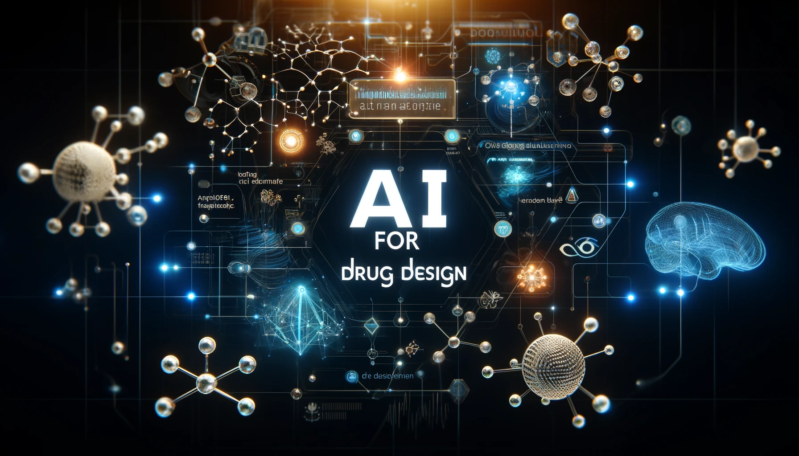

# AI-for-Drug-Design

powered by Jiacai Yi ❤

Welcome to the AI-for-Drug-Design repository, your resource for a curated collection of materials related to artificial intelligence in drug design. Whether you're a budding researcher, an experienced scientist, or simply someone keen on exploring the latest advancements and trends in AI-driven drug discovery, this repository has something for you. Here you'll find a compilation of valuable resources I've gathered over time, aimed at assisting and inspiring anyone interested in this cutting-edge field.

<!--  -->

Updating ...

## 📢 Something NEW

- 👉 [New! 2024 Journal Impact Factor Update (Cheminformatics and Bioinformatics section)](docs/JIF.md)

## 💻 Web Server & Database

- [Web Server & Database](tools/main.md)
