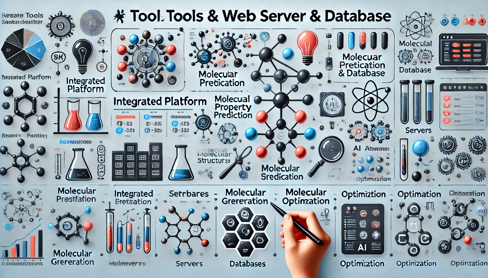

# 🧬 Web server & Database <!-- omit from toc -->

This section highlights the latest web server and databases for drug design.

## 📚 Table of Contents <!-- omit from toc -->

- [Web Server](#web-server)
  - [Nucleic Acids Research Web Server 2024](#nucleic-acids-research-web-server-2024)
  - [Integrated Platform](#integrated-platform)
  - [Molecular generation](#molecular-generation)
  - [Molecular property prediction](#molecular-property-prediction)
  - [Molecular optimization](#molecular-optimization)
  - [Structural Biology and Protein Topology](#structural-biology-and-protein-topology)
- [Database](#database)
  - [Nucleic Acids Research Database 2024](#nucleic-acids-research-database-2024)
  - [NAR relavent database - 2023](#nar-relavent-database---2023)

## Web Server

### Nucleic Acids Research Web Server 2024

- ✨ **The 22nd annual Nucleic Acids Research Web Server Issue 2024** [2024]

  Dominik Seelow

  [Nucleic Acids Res (2024)](https://doi.org/10.1093/nar/gkae492)

| Title                                                                 | URL                                                                                                                                                                                                      | Short description                                                                                                                                      |
| --------------------------------------------------------------------- | -------------------------------------------------------------------------------------------------------------------------------------------------------------------------------------------------------- | ------------------------------------------------------------------------------------------------------------------------------------------------------ |
| **DNA**                                                               |                                                                                                                                                                                                          |                                                                                                                                                        |
| Deep DNAshape webserver                                               | <a href="https://doi.org/10.1093/nar/gkae433" style="color: #2878b5;">Paper</a> \| <a href="https://deepdnashape.usc.edu" style="color: #FA7F6F;">Server</a>                                             | Prediction and real-time visualization of DNA shape considering extended k-mers                                                                        |
| DNAforge                                                              | <a href="https://doi.org/10.1093/nar/gkae367" style="color: #2878b5;">Paper</a> \| <a href="https://dnaforge.org/" style="color: #FA7F6F;">Server</a>                                                    | a design tool for nucleic acid wireframe nanostructures                                                                                                |
| iM-Seeker                                                             | <a href="https://doi.org/10.1093/nar/gkae315" style="color: #2878b5;">Paper</a> \| <a href="https://im-seeker.org" style="color: #FA7F6F;">Server</a>                                                    | a webserver for DNA i-motifs prediction and scoring via automated machine learning                                                                     |
| **Evolution / genetics / genomics / genome editing**                  |                                                                                                                                                                                                          |                                                                                                                                                        |
| AlPaCas                                                               | <a href="https://doi.org/10.1093/nar/gkae419" style="color: #2878b5;">Paper</a> \| <a href="https://schubert.bio.uniroma1.it/alpacas" style="color: #FA7F6F;">Server</a>                                 | Allele-specific CRISPR Gene Editing through a Protospacer-Adjacent-Motif (PAM) approach                                                                |
| Companion                                                             | <a href="https://doi.org/10.1093/nar/gkae378" style="color: #2878b5;">Paper</a> \| <a href="https://companion.ac.uk/" style="color: #FA7F6F;">Server</a>                                                 | Annotation and visualization of parasite, fungi and arthropod genomes                                                                                  |
| ChIP-Atlas 3.0:                                                       | <a href="https://doi.org/10.1093/nar/gkae358" style="color: #2878b5;">Paper</a> \| <a href="https://chip-atlas.org/" style="color: #FA7F6F;">Server</a>                                                  | A data-mining suite to explore chromosome architecture together with large-scale regulome data                                                         |
| DORA                                                                  | <a href="https://doi.org/10.1093/nar/gkae373" style="color: #2878b5;">Paper</a> \| <a href="https://dora.modelrxiv.org/" style="color: #FA7F6F;">Server</a>                                              | An interactive map for the visualization and analysis of ancient human DNA and associated data                                                         |
| DrawPed                                                               | <a href="https://doi.org/10.1093/nar/gkae336" style="color: #2878b5;">Paper</a> \| <a href="https://www.genecascade.org/DrawPed/" style="color: #FA7F6F;">Server</a>                                     | Drawing human pedigree charts                                                                                                                          |
| FEVER                                                                 | <a href="https://doi.org/10.1093/nar/gkae264" style="color: #2878b5;">Paper</a> \| <a href="https://fever.sk8.inrae.fr/" style="color: #FA7F6F;">Server</a>                                              | An interactive web-based resource for evolutionary transcriptomics across fishes                                                                       |
| Imputation Server PGS                                                 | <a href="https://doi.org/10.1093/nar/gkae331" style="color: #2878b5;">Paper</a> \| <a href="https://imputationserver.sph.umich.edu" style="color: #FA7F6F;">Server</a>                                   | An automated approach to calculate polygenic risk scores on imputation servers                                                                         |
| Interactive Tree Of Life (iTOL) v6                                    | <a href="https://doi.org/10.1093/nar/gkae268" style="color: #2878b5;">Paper</a> \| <a href="https://itol.embl.de" style="color: #FA7F6F;">Server</a>                                                     | Recent updates to the phylogenetic tree display and annotation tool                                                                                    |
| Galaxy                                                                | <a href="https://doi.org/10.1093/nar/gkw343" style="color: #2878b5;">Paper</a> \| <a href="https://galaxyproject.org" style="color: #FA7F6F;">Server</a>                                                 | Platform for accessible, reproducible, and collaborative data analyses (2024 update)                                                                   |
| LncRNAway                                                             | <a href="https://doi.org/10.1093/nar/gkae383" style="color: #2878b5;">Paper</a> \| <a href="https://www.lncrnaway.com" style="color: #FA7F6F;">Server</a>                                                | A web-based sgRNA design tool for precise and effective suppression of long noncoding RNAs                                                             |
| mtDNA-Server 2                                                        | <a href="https://doi.org/10.1093/nar/gkae296" style="color: #2878b5;">Paper</a> \| <a href="https://mitoverse.i-med.ac.at" style="color: #FA7F6F;">Server</a>                                            | Advancing mitochondrial DNA analysis through highly parallelized data processing and interactive analytics                                             |
| NeMu                                                                  | <a href="https://doi.org/10.1093/nar/gkae438" style="color: #2878b5;">Paper</a> \| <a href="https://nemu-pipeline.com/" style="color: #FA7F6F;">Server</a>                                               | A comprehensive pipeline for accurate reconstruction of neutral mutation spectra from evolutionary data                                                |
| SeqCAT                                                                | <a href="https://doi.org/10.1093/nar/gkae422" style="color: #2878b5;">Paper</a> \| <a href="https://mtb.bioinf.med.uni-goettingen.de/SeqCAT/" style="color: #FA7F6F;">Server</a>                         | Sequence conversion and analysis toolbox                                                                                                               |
| SynDesign                                                             | <a href="https://doi.org/10.1093/nar/gkae304" style="color: #2878b5;">Paper</a> \| <a href="https://deepcrispr.info/SynDesign" style="color: #FA7F6F;">Server</a>                                        | Web-based prime editing guide RNA design and evaluation tool for saturation genome editing                                                             |
| TEENA                                                                 | <a href="https://doi.org/10.1093/nar/gkae411" style="color: #2878b5;">Paper</a> \| <a href="https://sun-lab.yzu.edu.cn/TEENA/" style="color: #FA7F6F;">Server</a>                                        | An integrated web server for transposable element enrichment analysis in various model and non-model organisms                                         |
| **Variant assessment**                                                |                                                                                                                                                                                                          |                                                                                                                                                        |
| MutationExplorer                                                      | <a href="https://doi.org/10.1093/nar/gkae301" style="color: #2878b5;">Paper</a> \| <a href="http://proteinformatics.org/mutation_explorer/" style="color: #FA7F6F;">Server</a>                           | A webserver for mutation of proteins and 3D visualization of energetic impacts                                                                         |
| ProtVar                                                               | <a href="https://doi.org/10.1093/nar/gkae413" style="color: #2878b5;">Paper</a> \| <a href="https://www.ebi.ac.uk/protvar" style="color: #FA7F6F;">Server</a>                                            | Mapping and contextualising human missense variation                                                                                                   |
| REEV                                                                  | <a href="https://doi.org/10.1093/nar/gkae366" style="color: #2878b5;">Paper</a> \| <a href="https://reev.bihealth.org/" style="color: #FA7F6F;">Server</a>                                               | Review, evaluate and explain variants                                                                                                                  |
| **Proteins**                                                          |                                                                                                                                                                                                          |                                                                                                                                                        |
| AggreProt                                                             | <a href="https://doi.org/10.1093/nar/gkae420" style="color: #2878b5;">Paper</a> \| <a href="https://loschmidt.chemi.muni.cz/aggreprot/" style="color: #FA7F6F;">Server</a>                               | A web server for predicting and engineering aggregation prone regions in proteins                                                                      |
| Aggrescan4D                                                           | <a href="https://doi.org/10.1093/nar/gkae382" style="color: #2878b5;">Paper</a> \| <a href="https://biocomp.chem.uw.edu.pl/a4d/" style="color: #FA7F6F;">Server</a>                                      | Structure-informed analysis of pH-dependent protein aggregation                                                                                        |
| AIUPred                                                               | <a href="https://doi.org/10.1093/nar/gkae385" style="color: #2878b5;">Paper</a> \| <a href="https://aiupred.elte.hu" style="color: #FA7F6F;">Server</a>                                                  | Combining energy estimation with deep learning for the enhanced prediction of protein disorder                                                         |
| AlphaFind                                                             | <a href="https://doi.org/10.1093/nar/gkae397" style="color: #2878b5;">Paper</a> \| <a href="https://alphafind.fi.muni.cz" style="color: #FA7F6F;">Server</a>                                             | Discover structure similarity across the proteome in AlphaFold DB                                                                                      |
| AlphaKnot 2.0                                                         | <a href="https://doi.org/10.1093/nar/gkae443" style="color: #2878b5;">Paper</a> \| <a href="https://alphaknot.cent.uw.edu.pl/" style="color: #FA7F6F;">Server</a>                                        | A web server for the visualization of proteins’ knotting and a database of knotted AlphaFold-predicted models                                          |
| CASTpFold                                                             | <a href="https://doi.org/10.1093/nar/gkae415" style="color: #2878b5;">Paper</a> \| <a href="https://cfold.bme.uic.edu/castpfold/" style="color: #FA7F6F;">Server</a>                                     | Computed Atlas of Surface Topography of the universe of protein Folds                                                                                  |
| Damietta                                                              | <a href="https://doi.org/10.1093/nar/gkae297" style="color: #2878b5;">Paper</a> \| <a href="https://damietta.de/" style="color: #FA7F6F;">Server</a>                                                     | A comprehensive protein design toolkit                                                                                                                 |
| DDMut-PPI                                                             | <a href="https://doi.org/10.1093/nar/gkae412" style="color: #2878b5;">Paper</a> \| <a href="https://biosig.lab.uq.edu.au/ddmut_ppi" style="color: #FA7F6F;">Server</a>                                   | Predicting effects of mutations on protein–protein interactions using graph-based deep learning                                                        |
| DeepLoc 2.1                                                           | <a href="https://doi.org/10.1093/nar/gkae237" style="color: #2878b5;">Paper</a> \| <a href="https://services.healthtech.dtu.dk/services/DeepLoc-2.1/" style="color: #FA7F6F;">Server</a>                 | Multi-label membrane protein type prediction using protein language models                                                                             |
| DEGRONOPEDIA                                                          | <a href="https://doi.org/10.1093/nar/gkae238" style="color: #2878b5;">Paper</a> \| <a href="https://degronopedia.com/" style="color: #FA7F6F;">Server</a>                                                | A web server for proteome-wide inspection of degrons                                                                                                   |
| Frustraevo                                                            | <a href="https://doi.org/10.1093/nar/gkae244" style="color: #2878b5;">Paper</a> \| <a href="https://frustraevo.qb.fcen.uba.ar/" style="color: #FA7F6F;">Server</a>                                       | A web server to localize and quantify the conservation of local energetic frustration in protein families                                              |
| GPS-SUMO 2.0                                                          | <a href="https://doi.org/10.1093/nar/gkae346" style="color: #2878b5;">Paper</a> \| <a href="https://sumo.biocuckoo.cn/" style="color: #FA7F6F;">Server</a>                                               | An updated online service for the prediction of SUMOylation sites and SUMO-interacting motifs                                                          |
| GPSFun                                                                | <a href="https://doi.org/10.1093/nar/gkae381" style="color: #2878b5;">Paper</a> \| <a href="https://bio-web1.nscc-gz.cn/app/GPSFun" style="color: #FA7F6F;">Server</a>                                   | Geometry-aware protein sequence function predictions with language models                                                                              |
| MinActionPath2                                                        | <a href="https://doi.org/10.1093/nar/gkae421" style="color: #2878b5;">Paper</a> \| <a href="http://dynstr.pasteur.fr/servers/minactionpath/minactionpath2_submission" style="color: #FA7F6F;">Server</a> | Path generation between different conformations of large macromolecular assemblies by action minimization                                              |
| PPI3D                                                                 | <a href="https://doi.org/10.1093/nar/gkae278" style="color: #2878b5;">Paper</a> \| <a href="https://bioinformatics.lt/ppi3d" style="color: #FA7F6F;">Server</a>                                          | A web server for searching, analyzing and modeling protein–protein, protein–peptide and protein–nucleic acid interactions                              |
| PROSCA                                                                | <a href="https://doi.org/10.1093/nar/gkae384" style="color: #2878b5;">Paper</a> \| <a href="https://idrblab.org/prosca/" style="color: #FA7F6F;">Server</a>                                              | An online platform for humanized scaffold mining facilitating rational protein engineering                                                             |
| Proscan                                                               | <a href="https://doi.org/10.1093/nar/gkae408" style="color: #2878b5;">Paper</a> \| <a href="https://proscan.ibbr.umd.edu" style="color: #FA7F6F;">Server</a>                                             | A structure-based proline design web server                                                                                                            |
| PSIPRED                                                               | <a href="https://doi.org/10.1093/nar/gkz297" style="color: #2878b5;">Paper</a> \| <a href="http://bioinf.cs.ucl.ac.uk/psipred/" style="color: #FA7F6F;">Server</a>                                       | Protein Analysis Workbench                                                                                                                             |
| PypKa Server                                                          | <a href="https://doi.org/10.1093/nar/gkae255" style="color: #2878b5;">Paper</a> \| <a href="https://pypka.org" style="color: #FA7F6F;">Server</a>                                                        | Online pKa predictions and biomolecular structure preparation with precomputed data from PDB and AlphaFold DB                                          |
| REME                                                                  | <a href="https://doi.org/10.1093/nar/gkae405" style="color: #2878b5;">Paper</a> \| <a href="https://reme.biodesign.ac.cn/" style="color: #FA7F6F;">Server</a>                                            | An integrated platform for reaction enzyme mining and evaluation                                                                                       |
| RING 4.0                                                              | <a href="https://doi.org/10.1093/nar/gkae337" style="color: #2878b5;">Paper</a> \| <a href="https://ring.biocomputingup.it/" style="color: #FA7F6F;">Server</a>                                          | Faster residue interaction networks with novel interaction types across over 35 000 different chemical structures                                      |
| SLiMAn 2.0                                                            | <a href="https://doi.org/10.1093/nar/gkae398" style="color: #2878b5;">Paper</a> \| <a href="https://sliman2.cbs.cnrs.fr" style="color: #FA7F6F;">Server</a>                                              | Meaningful navigation through peptide-protein interaction networks                                                                                     |
| structure assessment                                                  | <a href="https://doi.org/10.1093/nar/gkae270" style="color: #2878b5;">Paper</a> \| <a href="https://swissmodel.expasy.org/assess" style="color: #FA7F6F;">Server</a>                                     | a one-stop shop for interactive evaluation and benchmarking of structural models of macromolecular complexes including proteins and nucleic acids      |
| SwissDock 2024                                                        | <a href="https://doi.org/10.1093/nar/gkae300" style="color: #2878b5;">Paper</a> \| <a href="https://dev.swissdock.ch/" style="color: #FA7F6F;">Server</a>                                                | major enhancements for small-molecule docking with attracting cavities and AutoDock Vina                                                               |
| WeSA                                                                  | <a href="https://doi.org/10.1093/nar/gkae423" style="color: #2878b5;">Paper</a> \| <a href="http://wesa.russelllab.org/" style="color: #FA7F6F;">Server</a>                                              | A web server for improving affinity proteomics data                                                                                                    |
| **RNA**                                                               |                                                                                                                                                                                                          |                                                                                                                                                        |
| IsoVis                                                                | <a href="https://doi.org/10.1093/nar/gkae343" style="color: #2878b5;">Paper</a> \| <a href="https://isomix.org/isovis/" style="color: #FA7F6F;">Server</a>                                               | A webserver for visualization and annotation of alternative RNA isoforms                                                                               |
| RNAhugs                                                               | <a href="https://doi.org/10.1093/nar/gkae259" style="color: #2878b5;">Paper</a> \| <a href="https://rnahugs.cs.put.poznan.pl/" style="color: #FA7F6F;">Server</a>                                        | Web server for customized 3D RNA structure alignment                                                                                                   |
| RNAscape                                                              | <a href="https://doi.org/10.1093/nar/gkae269" style="color: #2878b5;">Paper</a> \| <a href="https://rnascape.usc.edu/" style="color: #FA7F6F;">Server</a>                                                | Geometric mapping and customizable visualization of RNA structure                                                                                      |
| SHAPEwarp-web                                                         | <a href="https://doi.org/10.1093/nar/gkae348" style="color: #2878b5;">Paper</a> \| <a href="https://shapewarp.incarnatolab.com" style="color: #FA7F6F;">Server</a>                                       | Sequence-agnostic search for structurally homologous RNA regions across databases of chemical probing data                                             |
| SimRNAweb v2.0                                                        | <a href="https://doi.org/10.1093/nar/gkae356" style="color: #2878b5;">Paper</a> \| <a href="https://genesilico.pl/SimRNAweb" style="color: #FA7F6F;">Server</a>                                          | A web server for RNA folding simulations and 3D structure modeling, with optional restraints and enhanced analysis of folding trajectories             |
| SingmiR                                                               | <a href="https://doi.org/10.1093/nar/gkae225" style="color: #2878b5;">Paper</a> \| <a href="https://ccb-compute.cs.uni-saarland.de/singmir" style="color: #FA7F6F;">Server</a>                           | A single-cell miRNA alignment and analysis tool                                                                                                        |
| **Metabolomics / lipidomics / microbiome**                            |                                                                                                                                                                                                          |                                                                                                                                                        |
| GCMS-ID                                                               | <a href="https://doi.org/10.1093/nar/gkae425" style="color: #2878b5;">Paper</a> \| <a href="https://gcms-id.ca/" style="color: #FA7F6F;">Server</a>                                                      | A webserver for identifying compounds from gas chromatography mass spectrometry experiments                                                            |
| LipidSig 2.0                                                          | <a href="https://doi.org/10.1093/nar/gkae335" style="color: #2878b5;">Paper</a> \| <a href="https://lipidsig.bioinfomics.tw/" style="color: #FA7F6F;">Server</a>                                         | Integrating lipid characteristic insights into advanced lipidomics data analysis                                                                       |
| MetaboAnalyst 6.0                                                     | <a href="https://doi.org/10.1093/nar/gkae253" style="color: #2878b5;">Paper</a> \| <a href="https://www.metaboanalyst.ca" style="color: #FA7F6F;">Server</a>                                             | Towards a unified platform for metabolomics data processing, analysis and interpretation                                                               |
| Mibianto                                                              | <a href="https://doi.org/10.1093/nar/gkae364" style="color: #2878b5;">Paper</a> \| <a href="https://www.ccb.uni-saarland.de/mibianto" style="color: #FA7F6F;">Server</a>                                 | Ultra-efficient online microbiome analysis through k-mer based metagenomics                                                                            |
| WebGestalt 2024                                                       | <a href="https://doi.org/10.1093/nar/gkae456" style="color: #2878b5;">Paper</a> \| <a href="https://2024.webgestalt.org" style="color: #FA7F6F;">Server</a>                                              | Faster gene set analysis and new support for metabolomics and multi-omics                                                                              |
| **Cheminformatics / pharmacokinetics**                                |                                                                                                                                                                                                          |                                                                                                                                                        |
| ADMETLAB 3.0                                                          | <a href="https://doi.org/10.1093/nar/gkae236" style="color: #2878b5;">Paper</a> \| <a href="https://admetlab3.scbdd.com" style="color: #FA7F6F;">Server</a>                                              | An updated comprehensive online ADMET prediction platform enhanced with broader coverage, improved performance, API functionality and decision support |
| admetSAR3.0                                                           | <a href="https://doi.org/10.1093/nar/gkae298" style="color: #2878b5;">Paper</a> \| <a href="http://lmmd.ecust.edu.cn/admetsar3/" style="color: #FA7F6F;">Server</a>                                      | A comprehensive platform for exploration, prediction and optimization of chemical ADMET properties                                                     |
| ChemFH                                                                | <a href="https://doi.org/10.1093/nar/gkae424" style="color: #2878b5;">Paper</a> \| <a href="https://chemfh.scbdd.com/" style="color: #FA7F6F;">Server</a>                                                | An integrated tool for screening frequent false positives in chemical biology and drug discovery                                                       |
| ChemFREE                                                              | <a href="https://doi.org/10.1093/nar/gkae446" style="color: #2878b5;">Paper</a> \| <a href="http://chemfree.agroda.cn/chemfree/" style="color: #FA7F6F;">Server</a>                                      | A one-stop comprehensive platform for ecological and environmental risk evaluation of chemicals in One Health world                                    |
| ChemoDOTS                                                             | <a href="https://doi.org/10.1093/nar/gkae326" style="color: #2878b5;">Paper</a> \| <a href="https://chemodots.marseille.inserm.fr/" style="color: #FA7F6F;">Server</a>                                   | A web server to design chemistry-driven focused libraries                                                                                              |
| Deep-PK                                                               | <a href="https://doi.org/10.1093/nar/gkae254" style="color: #2878b5;">Paper</a> \| <a href="https://biosig.lab.uq.edu.au/deeppk/" style="color: #FA7F6F;">Server</a>                                     | Deep learning for small molecule pharmacokinetic and toxicity prediction                                                                               |
| DetSpace                                                              | <a href="https://doi.org/10.1093/nar/gkae287" style="color: #2878b5;">Paper</a> \| <a href="https://detspace.carbonelllab.org/" style="color: #FA7F6F;">Server</a>                                       | A web server for engineering detectable pathways for bio-based chemical production                                                                     |
| Drugst.One                                                            | <a href="https://doi.org/10.1093/nar/gkae388" style="color: #2878b5;">Paper</a> \| <a href="https://drugst.one" style="color: #FA7F6F;">Server</a>                                                       | A plug-and-play solution for online systems medicine and network-based drug repurposing                                                                |
| KinomeMETA                                                            | <a href="https://doi.org/10.1093/nar/gkae380" style="color: #2878b5;">Paper</a> \| <a href="https://kinomemeta.alphama.com.cn/" style="color: #FA7F6F;">Server</a>                                       | A web platform for kinome-wide polypharmacology profiling with meta-learning                                                                           |
| MolModa                                                               | <a href="https://doi.org/10.1093/nar/gkae406" style="color: #2878b5;">Paper</a> \| <a href="https://durrantlab.com/molmoda" style="color: #FA7F6F;">Server</a>                                           | Accessible and secure molecular docking in a web browser                                                                                               |
| Pred-O3                                                               | <a href="https://doi.org/10.1093/nar/gkae305" style="color: #2878b5;">Paper</a> \| <a href="https://odor.rpbs.univ-paris-diderot.fr/" style="color: #FA7F6F;">Server</a>                                 | A web server to predict molecules, olfactory receptors and odor relationships                                                                          |
| ProTox-3.0                                                            | <a href="https://doi.org/10.1093/nar/gkae303" style="color: #2878b5;">Paper</a> \| <a href="https://tox.charite.de/" style="color: #FA7F6F;">Server</a>                                                  | A webserver for the prediction of toxicity of chemicals                                                                                                |
| **Others**                                                            |                                                                                                                                                                                                          |                                                                                                                                                        |
| The EMBL-EBI Job Dispatcher sequence analysis tools framework in 2024 | <a href="https://doi.org/10.1093/nar/gkae241" style="color: #2878b5;">Paper</a> \| <a href="https://www.ebi.ac.uk/jdispatcher" style="color: #FA7F6F;">Server</a>                                        | enables the scientific community to perform a diverse range of sequence analyses using popular bioinformatics applications.                            |
| Next-Generation IEDB Tools                                            | <a href="https://doi.org/10.1093/nar/gkae407" style="color: #2878b5;">Paper</a> \| <a href="https://nextgen-tools.iedb.org" style="color: #FA7F6F;">Server</a>                                           | A platform for epitope prediction and analysis                                                                                                         |
| SEMA 2.0                                                              | <a href="https://doi.org/10.1093/nar/gkae386" style="color: #2878b5;">Paper</a> \| <a href="https://sema.airi.net" style="color: #FA7F6F;">Server</a>                                                    | Web-platform for B-cell conformational epitopes prediction using artificial intelligence                                                               |
| PubTator 3.0                                                          | <a href="https://doi.org/10.1093/nar/gkae235" style="color: #2878b5;">Paper</a> \| <a href="https://www.ncbi.nlm.nih.gov/research/pubtator3/" style="color: #FA7F6F;">Server</a>                         | An AI-powered literature resource for unlocking biomedical knowledge                                                                                   |
| TTSBBC                                                                | <a href="https://doi.org/10.1093/nar/gkae312" style="color: #2878b5;">Paper</a> \| <a href="https://kowalski-labapps.dellmed.utexas.edu/TTSBBC/" style="color: #FA7F6F;">Server</a>                      | Triplex target site biomarkers and barcodes in cancer                                                                                                  |

### Integrated Platform

- **DrugFlow: An AI-Driven One-Stop Platform for Innovative Drug Discovery** [2024]

  Chao Shen, Jianfei Song, Chang-Yu Hsieh, Dongsheng Cao, Yu Kang, Wenling Ye, Zhenxing Wu, Jike Wang, Odin Zhang, Xujun Zhang, Hao Zeng, Heng Cai, Yu Chen, Linkang Chen, Hao Luo, Xinda Zhao, Tianye Jian, Tong Chen, Dejun Jiang, Mingyang Wang, Qing Ye, Jialu Wu, Hongyan Du, Hui Shi, Yafeng Deng, and Tingjun Hou

  [J Chem Inf Model (2024)](https://doi.org/10.1021/acs.jcim.4c00621) | [Server](https://drugflow.com/)

- **WeMol - AI 药物设计软件平台**

  中大唯信·唯信计算

  [Home](https://www.wecomput.com/) | [Server](https://wemol.wecomput.com/)

### Molecular generation

- **Reinvent 4: Modern AI–driven generative molecule design** [2024]

  Hannes H. Loeffler, Jiazhen He, Alessandro Tibo, Jon Paul Janet, Alexey Voronov, Lewis H. Mervin & Ola Engkvist

  [J Cheminform (2024)](https://doi.org/10.1186/s13321-024-00812-5) | [Code](https://github.com/MolecularAI/REINVENT4)

- **ChemoDOTS: a web server to design chemistry-driven focused libraries** [2024]

  Laurent Hoffer, Guillaume Charifi-Hoareau, Sarah Barelier, Stéphane Betzi, Thomas Miller, Xavier Morelli, Philippe Roche

  [Nucleic Acids Res (2024)](https://doi.org/10.1093/nar/gkae326) | [Server](https://chemodots.marseille.inserm.fr/)

- **The Damietta Server: a comprehensive protein design toolkit** [2024]

  Iwan Grin, Kateryna Maksymenko, Tobias Wörtwein, Mohammad ElGamacy

  [Nucleic Acids Res (2024)](https://doi.org/10.1093/nar/gkae297) | [Server](https://damietta.de/)

- **ACFIS 2.0: an improved web-server for fragment-based drug discovery via a dynamic screening strategy** [2024]

  Xing-Xing Shi, Zhi-Zheng Wang, Fan Wang, Ge-Fei Hao, Guang-Fu Yang

  [Nucleic Acids Res (2023)](https://doi.org/10.1093/nar/gkad348) | [Server](http://chemyang.ccnu.edu.cn/ccb/server/ACFIS2/)

### Molecular property prediction

- **ADMETlab 3.0: an updated comprehensive online ADMET prediction platform enhanced with broader coverage, improved performance, API functionality and decision support** [2024]

  Li Fu, Shaohua Shi, Jiacai Yi, Ningning Wang, Yuanhang He, Zhenxing Wu, Jinfu Peng, Youchao Deng, Wenxuan Wang, Chengkun Wu, Aiping Lyu, Xiangxiang Zeng, Wentao Zhao, Tingjun Hou, Dongsheng Cao

  [Nucleic Acids Res (2024)](https://doi.org/10.1093/nar/gkae236) | [Server](https://admetlab3.scbdd.com/)

- **ChemFH: an integrated tool for screening frequent false positives in chemical biology and drug discovery** [2024]

  Shaohua Shi, Li Fu, Jiacai Yi, Ziyi Yang, Xiaochen Zhang, Youchao Deng, Wenxuan Wang, Chengkun Wu, Wentao Zhao, Tingjun Hou, Xiangxiang Zeng, Aiping Lyu, Dongsheng Cao

  [Nucleic Acids Res (2024)](https://doi.org/10.1093/nar/gkae424) | [Server](https://chemfh.scbdd.com/)

- **KinomeMETA: a web platform for kinome-wide polypharmacology profiling with meta-learning** [2024]

  Zhaojun Li, Ning Qu, Jingyi Zhou, Jingjing Sun, Qun Ren, Jingyi Meng, Guangchao Wang, Rongyan Wang, Jin Liu, Yijie Chen, Sulin Zhang, Mingyue Zheng, Xutong Li

  [Nucleic Acids Res (2024)](https://doi.org/10.1093/nar/gkae380) | [Server](https://kinomemeta.alphama.com.cn/)

- **admetSAR3.0: a comprehensive platform for exploration, prediction and optimization of chemical ADMET properties** [2024]

  Yaxin Gu, Zhuohang Yu, Yimeng Wang, Long Chen, Chaofeng Lou, Chen Yang, Weihua Li, Guixia Liu, Yun Tang

  [Nucleic Acids Res (2024)](https://doi.org/10.1093/nar/gkae298) | [Server](http://lmmd.ecust.edu.cn/admetsar3/)

- **ProTox 3.0: a webserver for the prediction of toxicity of chemicals** [2024]

  Priyanka Banerjee, Emanuel Kemmler, Mathias Dunkel, Robert Preissner

  [Nucleic Acids Res (2024)](https://doi.org/10.1093/nar/gkae303) | [Server](https://tox.charite.de/)

- **Deep-PK: deep learning for small molecule pharmacokinetic and toxicity prediction** [2024]

  Yoochan Myung, Alex G C de Sá, David B Ascher

  [Nucleic Acids Res (2024)](https://doi.org/10.1093/nar/gkae254) | [Server](https://biosig.lab.uq.edu.au/deeppk/)

- **PypKa server: online pKa predictions and biomolecular structure preparation with precomputed data from PDB and AlphaFold DB** [2024]

  Pedro B P S Reis, Djork-Arné Clevert, Miguel Machuqueiro

  [Nucleic Acids Res (2024)](https://doi.org/10.1093/nar/gkae255) | [Server](https://pypka.org/)

- **BioTransformer 3.0—a web server for accurately predicting metabolic transformation products** [2024]

  David S Wishart, Siyang Tian, Dana Allen, Eponine Oler, Harrison Peters, Vicki W Lui, Vasuk Gautam, Yannick Djoumbou-Feunang, Russell Greiner, Thomas O Metz

  [Nucleic Acids Res (2024)](https://doi.org/10.1093/nar/gkac313) | [Server](https://biotransformer.ca/)

### Molecular optimization

- **ChemMORT: an automatic ADMET optimization platform using deep learning and multi-objective particle swarm optimization** [2024]

  Jia-Cai Yi, Zi-Yi Yang, Wen-Tao Zhao, Zhi-Jiang Yang, Xiao-Chen Zhang, Cheng-Kun Wu, Ai-Ping Lu, Dong-Sheng Cao

  [Brief Bioinform (2024)](https://doi.org/10.1093/bib/bbae008) | [Server](https://cadd.nscc-tj.cn/deploy/chemmort/)

- **OptADMET: a web-based tool for substructure modifications to improve ADMET properties of lead compounds** [2024]

  Jiacai Yi, Shaohua Shi, Li Fu, Ziyi Yang, Pengfei Nie, Aiping Lu, Chengkun Wu, Yafeng Deng, Changyu Hsieh, Xiangxiang Zeng, Tingjun Hou, Dongsheng Cao

  [Nat Protoc (2024)](https://doi.org/10.1038/s41596-023-00942-4) | [Server](https://cadd.nscc-tj.cn/deploy/optadmet/)

### Structural Biology and Protein Topology

- **AlphaKnot 2.0: a web server for the visualization of proteins’ knotting and a database of knotted AlphaFold-predicted models** [2024]

  Pawel Rubach, Maciej Sikora, Aleksandra I Jarmolinska, Agata P Perlinska, Joanna I Sulkowska

  [Nucleic Acids Res (2024)](https://doi.org/10.1093/nar/gkae443) | [Server](https://alphaknot.cent.uw.edu.pl/)

- **AggreProt: a web server for predicting and engineering aggregation prone regions in proteins** [2024]

  Joan Planas-Iglesias, Simeon Borko, Jan Swiatkowski, Matej Elias, Martin Havlasek, Ondrej Salamon, Ekaterina Grakova, Antonín Kunka, Tomas Martinovic, Jiri Damborsky, Jan Martinovic, David Bednar

  [Nucleic Acids Res (2024)](https://doi.org/10.1093/nar/gkae420) | [Server](https://loschmidt.chemi.muni.cz/aggreprot/)

## Database

### Nucleic Acids Research Database 2024

- ✨ **The 2024 Nucleic Acids Research database issue and the online molecular biology database collection** [2024]

  Daniel J Rigden, Xosé M Fernández

  [Nucleic Acids Res (2024)](https://doi.org/10.1093/nar/gkad1173) | [Server](http://www.oxfordjournals.org/nar/database/c/)

- ✨ [NAR online Molecular Biology Database Collection](http://www.oxfordjournals.org/nar/database/c/)

### NAR relavent database - 2023

| Database name     | URL                                                                                                                                             | Short description                                                                   |
| ----------------- | ----------------------------------------------------------------------------------------------------------------------------------------------- | ----------------------------------------------------------------------------------- |
| Withdrawn 2.0     | [Database](https://bioinformatics.charite.de/withdrawn_3/index.php) [Paper](https://doi.org/10.1093/nar/gkad1017)                               | withdrawn drugs with pharmacovigilance data                                         |
| DDBJ 2023         | [Database](https://www.ddbj.nig.ac.jp/) [Paper](https://doi.org/10.1093/nar/gkad1046)                                                           | metabolomics data and associated metadata                                           |
| PLAbDab           | [Database](https://opig.stats.ox.ac.uk/webapps/plabdab/) [Paper](https://doi.org/10.1093/nar/gkad1056) [Code](https://github.com/oxpig/PLAbDab) | reference set of antibody sequences and structures                                  |
| MetaboLights      | [Database](https://www.ebi.ac.uk/metabolights) [Paper](https://doi.org/10.1093/nar/gkad1045) [Code](https://github.com/EBI-Metabolights)        | open data repository for metabolomics                                               |
| ChEMBL 2023       | [Database](https://www.ebi.ac.uk/chembl/) [Paper](https://doi.org/10.1093/nar/gkad1004)                                                         | a drug discovery platform spanning multiple bioactivity data types and time periods |
| AlphaFold DB 2024 | [Database](https://alphafold.ebi.ac.uk/) [Paper](https://doi.org/10.1093/nar/gkad1011)                                                          | structure coverage for over 214 million protein sequences                           |
| INTEDE 2.0        | [Database](http://idrblab.org/intede/) [Paper](https://doi.org/10.1093/nar/gkad1013)                                                            | the metabolic roadmap of drugs                                                      |
| DescribePROT 2023 | [Database](http://biomine.cs.vcu.edu/servers/DESCRIBEPROT/) [Paper](https://doi.org/10.1093/nar/gkad985)                                        | amino acid-level descriptors of protein structures and functions                    |
| ADCdb             | [Database](https://idrblab.org/adcdb/) [Paper](https://doi.org/10.1093/nar/gkad831)                                                             | antibody–drug conjugates                                                            |
| PharmGWAS         | [Database](https://ngdc.cncb.ac.cn/pharmgwas) [Paper](https://doi.org/10.1093/nar/gkad832)                                                      | GWAS (genome-wide association studies)-based knowledgebase for drug repurposing     |
| VARIDT 3.0        | [Database](https://idrblab.org/varidt/) [Paper](https://doi.org/10.1093/nar/gkad818)                                                            | phenotypic and regulatory variability of drug transporter (DT)                      |
| TTD               | [Database](https://idrblab.org/ttd/) [Paper](https://doi.org/10.1093/nar/gkad751)                                                               | target druggability information                                                     |
| BioLiP2           | [Database](https://zhanggroup.org/BioLiP) [Paper](https://doi.org/10.1093/nar/gkad630)                                                          | biologically relevant ligand–protein interactions                                   |
